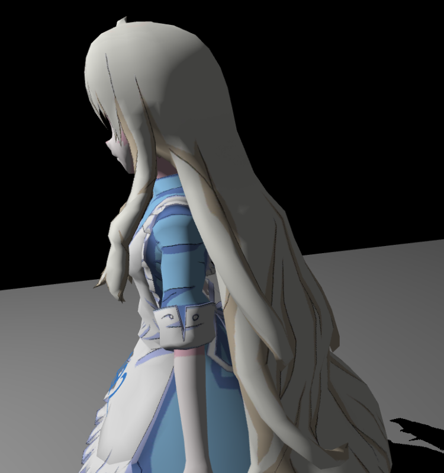

# 实时阴影

一个带有光源的场景中，物体如果没有阴影就会显得很假，所以在渲染中，阴影是很重要的一 Part。

## 硬阴影

假设场景中只有一个理想的点光源，它产生的阴影就是硬阴影。硬阴影边界清晰，显得很硬。
最经典的计算硬阴影的算法是 Shadow Mapping，相比于直接对场景进行无阴影的渲染，Shadow Mapping 需要在渲染流程中多一个 Pass：

- 第一个 Pass 先从光源点作为 camera 视角渲染出一个深度图，也就是 Shadow Map，
- 第二个 Pass 再从当前摄像机渲染最终得到的场景，在渲染场景时，把像素点变换到光源空间中，并将物体在光源空间的深度值与 Shadow Map 中同一个 uv 坐标记录的深度做对比，如果大于 Shadow Map 中记录的值，则表明该点被其他物体遮挡，也就是在阴影中。

### 自遮挡

但简单的 Shadow Mapping 在实现中通常会遇到一个叫做自遮挡的问题。

这是由于 Shadow Map 的精度不足而引起的，从光源视角生成的 Shadow Map 中的一个像素对应了实际场景中的一小片区域，但这片区域中实际的深度往往和 Shadow Map 中记录的深度存在一些偏差，这就导致一个像素被它相邻像素所遮挡，也就是自遮挡问题，称为 Shadow Acne。

随着光源从垂直场景的位置向着平行于场景的位置不断移动，自遮挡问题造成的影响也会越来越明显。为解决这个问题，通常会引入一个 (variable) bias 来降低误差，然而过大的 bias 会导致阴影悬浮问题（Peter Panning）。因此这个 bias 的具体取值应当与光源方向与法线方向相关，通常与 `1 - dot(lightDir, normal)` 相关，具体可以参照 [自适应 Shadow Bias](https://zhuanlan.zhihu.com/p/370951892) 给出的公式。

### 走样

Shadow Map 是一张有分辨率 FrameBuffer，所以会因为采样精度的问题产生走样现象。一个解决阴影出现的 Perspective Aliasing（透视走样）问题，几乎称得上是最佳的方法便是级联阴影贴图 （Cascaded Shadow Maps）。

直观上可以想象到，当眼睛非常接近几何图形时，需要图形有着更高的分辨率。而当集合图形距离眼镜很远时，对分辨率的要求也就变得更低一些。因此 CSM 便是根据相机视锥的不同区域，记录具有不同分辨率的 Shadow Map。与距离较远的对象相比，最靠近眼睛的对象需要更高的分辨率。

CSM 的实现主要分为以下几步：

1. 沿着相机中心轴将视锥切成多个视锥；
2. 给光线为每一个子视锥都建立一个视图投影矩阵（View-Projection Matrix）；
3. 在所有子视锥上渲染一个 Shadow Map；
4. 在着色器中，确定片段位于哪个级联中，并使用相应的 Shadow Map 和视图投影来计算阴影值；

另一种直观且行之有效的方法便是过滤，也就是下文提到的 PCF。

## 软阴影

### Percentage-Closer Filtering PCF

PCF 把在 Shadow Map 采样后做深度比较的结果相加后进行平均，得到一个模糊的结果，把这个模糊的结果作为 visibility 项，即可使得阴影边界变得柔和。

PCF 一开始是用于阴影抗锯齿上，后来人们发现可以用来实现软阴影，采样范围越大，阴影越“软”。其主要方式是在计算着色点与 Shadow Map 中该点深度值的比较的时候，不仅采样该像素点的深度值，同时采样周边多个 Shadow Map 点深度值，逐一比较并求平均值，从而获得了一个从 0 到 1 的连续分布，能够表现不同明暗程度的阴影。

#### The math behind PCF

如下图对于着色点 $x$，我们比较 $x$ 的 $z$ 轴值和周围一系列点的 Shadow Map 中的值，并将比较得到的结果（0 或 1）求平均，即为 $x$ 点阴影的 visibility 项。

这种求平均的计算方式用数学的***卷积/滤波***表达式来表示为：

$$
\left[w * f\right] (p) = \sum_{q \in \mathcal N(p)} w(p, q)f(q)
$$

$\mathcal{N}(p)$是 $p$ 点的邻域， $w(p, q)$ 表示任一邻域采样点 $q$ 对 $p$ 的权重，$f(q)$ 表示该位置的值。

在 PCF 中有：

$$
V(x) = \sum_{q \in \mathcal N(x)} w(x, q) \cdot \chi^+\left[D_{SM}(q) - D_{scene}(x)\right]
$$

通常情况下我们的采样图案已经包含了重要性条件（本文使用的是 [泊松圆盘采样](https://codepen.io/arkhamwjz/pen/MWbqJNG?editors=1010) 或泊松均匀采样），所以这个权重值可以忽略。在这个表达式中， $\chi^+$ 函数表示一个非 0 即 1 的值，表示 Shadow Map 上的 $q$ 点深度值大于场景中 $x$ 点深度的时候表示该点不存在遮挡，即返回 1 表示可见，否则返回 0。

因此，PCF 不是对 Shadow Map 存储的深度做滤波，这没有任何的物理意义，所得到的最终结果也仍然是一个非 0 即 1 的值：

$$
V(x) \neq \chi^+ \left\{[w(x, q) \cdot D_{SM}](q) - D_{scene}(x) \right\}
$$

也不是对最终形成的硬阴影做滤波：

$$
V(x) \neq \sum_{q \in \mathcal N(x)} w(x, q) \cdot V(q)
$$

本文的 PCF 实现首先需要两个参数，一是采样范围，二是采样数量，然后我们需要描述如何在指定范围内采样到指定数量的样本。使用 `poissonDiskSamples` 采样函数，并把`NUM_SAMPLES` 调整为 `200.`，`FILTER_RADIUS` 设置为 `20.`，具体效果如下：

### Percentage-Closer Soft Shadows PCSS

PCF 由于采样区域是固定大小的，因此会在所有地方展示同样形状的软阴影，这会显示不自然的结果，尤其是遮挡物与地面存在一些接触时，合理的软阴影会像下图 Dying Light 这样。

可以看出，在真实的光照阴影中，靠近遮挡物的部分，阴影边界会比较锐利，而远离遮挡物的阴影边界则比较模糊。

PCSS 算法主要是在 PCF 基础上，根据遮挡物与光源和着色点的距离，利用相似三角形的原理，动态的计算出 PCF 应该采样的范围大小：

$$
w_{Penumbra} = (d_{Receiver} - d_{Blocker}) \cdot w_{Light} / d_{Blocker}
$$

其中 $w_{Penumbra}$ 表示 PCF 采样范围， $d_{Receiver}$ 表示着色点与平均遮挡物（后续会说计算方法）的距离， $d_{Blocker}$ 表示光源与平均遮挡物的距离， $w_{Light}$ 表示面光源的范围（只有面光源会生成软阴影）。此处上下由于是两个相似三角形，其直角边的比例和长边比例一致，所以可以直接计算与平面的距离而不用真的算出着色点的距离。

在上述公式中， $d_{Receiver}$ 的深度是已知的， $w_{Light}$ 的大小是预先设定的，那么剩下的是平均遮挡物的深度 $d_{Blocker}$ 了。为此，我们使用了一个从着色点出发向面光源的视锥，这个视锥会在该光源生成的 Shadow Map（通常位于光源的近平面上）中圈出一片范围，则这部分范围内的深度值将会用来采样并计算平均遮挡物距离。

PCSS 的整体步骤主要分为三步：

1. Blocker search：计算出范围内遮挡物的平均深度 $d_{Blocker}$；
2. Penumbra estimation：计算出 Penumbra 作为 PCF 的采样范围 $w_{Penumbra}$；
3. Percentage Closer Filtering：根据上一步计算出的采样范围，进行 PCF;

最终结果如下：

虽然使用采样的方法必然会产生噪声，且后续的 VSM、MSM 等为解决噪声作出了许多改进，但在图像处理技术不断发展的今天，对有噪声的图像进行后处理往往要比其他改进更加方便快捷。因此 PCSS 仍然是当今使用最广泛最经典的软阴影算法。

### Variance Shadow Maps VSM

在 PCSS 的第一步和第三步中，都有对区域内进行比较并计算平均（滤波/卷积）的步骤，若不采样则会导致巨大的计算量，如果采样，则必然会有误差或噪声，此时需要执行图像空间降噪来处理。为了解决 PCSS 的这个问题，提出了 VSSM（VSM）方法，针对性解决PCSS的第一步和第三步速度慢的问题。

#### step3 加速

首先观察第三步 PCF 部分的算法，这一步要做的事是将着色点的深度与 shadow map 中附近点的深度值比较计算平均，即找到比着色点深度小的 shadow map 中的点，也就相当于当前着色点深度在 shadow map 范围内所有深度的一个排名。可以使用正态分布来近似整个排名，从而直接获得着色点深度的大概位置，就能知道被遮挡的比例。

正态分布需要均值 $E$ 和方差 $V$ 两个参数来确定，均值可以用 MipMap 或 SAT(Summed Area Table, 即二维前缀和) 来获得，方差 $V$ 通过均值 $E(x)$ 和平方的均值 $E(x^2)$ 计算得到，所以需要存储均值和均值平方两个值就能存储每一个区域的正态分布。在生成 shadow map 的时候生成深度平方的 map 即可。

已知区域的均值和方差，以及着色点深度值，就能通过切比雪夫不等式来近似计算出可见程度 $(x > t)$。所有的计算都是 $O(1)$ 时间，且不用采样或循环，但是切比雪夫本身带有近似性质。

#### step1 加速

step3 中需要知道的是两个值之间的大小比较，而 step1 中则需要累加并计算具体的平均深度，略有不同，所以无法像上面一样仅用切比雪夫不等式计算。

假设未遮挡部分平均深度值为 $Z_{unocc}$，存在遮挡部分平均深度值为 $Z_{occ}$，未遮挡像素个数为 $N_1$，遮挡像素个数为 $N_2$，设整体区域的平均深度为 $Z_{Avg}$，总像素个数为 $N$，则满足如下关系：

$$
\frac{N_1}{N} Z_{unocc} + \frac{N_2}{N} Z_{occ} = Z_{Avg}
$$

则，我们需要通过这个关系来计算出需要的遮挡物平均深度值 $Z_{occ}$ 。利用切比雪夫不等式，我们可以得到 $N_1$, $N_2$ 的值，再大胆假设非遮挡物平均深度为着色点深度值（模拟接收物为平面），而平均深度 $Z_{Avg}$ 由 mipmaps 或 SAT 得知，N已知，则可以直接求解出平均遮挡物深度 $Z_{occ}$。

### Moment Shadow Mapping MSM

VSM 在为 PCSS 算法提高效率的过程中使用了很多假设的分布条件，而当这些假设分布条件与真实情况误差较大的时候，就可能会造成 Light Leaking 漏光等问题。MSM 是对 VSM 的一个改进，主要提高了范围内数据分布的精确性。

为了让 VSM 中对分布的描述更加精确，提出了使用高阶矩 m 来描述分布的方法。如下图中，蓝色线段是 PCF 比较范围内的深度概率分布 CDF，VSM 只使用了两阶的矩，而 MSM 会使用四阶矩来近似这个 CDF，显然会更加准确。类似将 CDF 多项式展开，并保留前 m 项。

存储前四阶矩只需要四通道贴图即可，但是用四阶矩来恢复这个CDF涉及到很复杂的数学推导问题。VSM效果如图：

## 距离场阴影

自有向距离场（Signed Distance Field, SDF）被提出以来，其相关概念被迅速应用至图形学的各个领域中。

数学上来说，SDF 是定义在空间中的一个标量场，标量值为空间一点到曲面的距离。曲面外的点为正值，曲面上的点为 0，曲面内的点为负数。对于需要渲染的 3d 场景来说，我们需要计算它到场景中所有物体的最近距离，来生成 Distance Field。

而有向距离场在阴影中的应用主要是根据 [Ray Marching](https://en.wikipedia.org/wiki/Volume_ray_casting) 来确定当前像素被遮挡的百分比。

从当前点出发，向光源中心射出一条射线，并记录步进过程中最小的“安全距离”，也就是距离场中记录的值，这个值表示从 $p$ 点到切线的距离。由此，可以根据这个距离的大小，来算出切线到射线的夹角 $\theta$，而 $\theta$ 的值越小，当前点的“安全角度”也就越小，即被遮挡的部分也就越多。从而我们便可以根据 $\theta$ 与 点 $o$ 到点 $p$ 的距离来近似的出当前点的 visibility 项。

$$
V(x) \approx \min \{ \frac{k \cdot SDF(p)}{|p - o|} \}
$$

其中参数 $k$ 和上界 $1.0$ 用来控制阴影的软硬程度。 $\frac{k \cdot SDF(p)}{|p - o|}$ 的取值范围在 $[0, 1]$ 区间内，因此当 $k$ 值越大时，也就更早的到达上界 $1.0$ ，从而实现出硬阴影。如下图所示分别是 $k = 2$ 、 $k = 8$ 和 $k = 32$ 的结果。

## Reference

[1] [GAMES202-高质量实时渲染](https://www.bilibili.com/video/BV1YK4y1T7yY/?p=3&share_source=copy_web&vd_source=0010cd145c4589a828366dd2f6c17219) - 闫令琪

[2] [实时渲染｜Shadow Map：PCF、PCSS、VSM、MSM](https://zhuanlan.zhihu.com/p/369710758) - kakaroto的文章 - 知乎

[3] [实时阴影](https://zhuanlan.zhihu.com/p/595039591) - 花桑的文章 - 知乎
